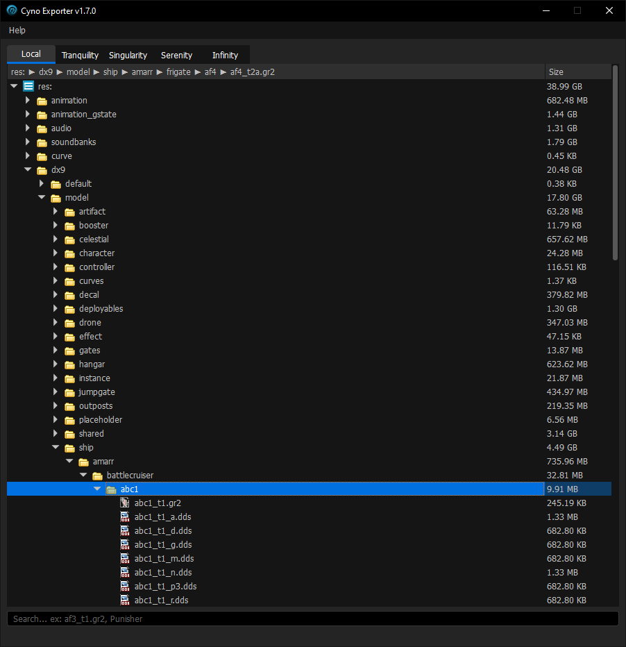

<h1>
Cyno Exporter

</h1>
This application reads and extracts files from EVE Online's local cache and all of the available server archives

<hr>


## Installation

1. Clone the repository:
```sh
git clone https://github.com/largeBIGsnooze/cyno-exporter

cd cyno-exporter
```
2. Install the required dependencies:
```sh
python -m pip install --upgrade pip

pip install -r requirements.txt
```

## Usage
1. Start the app:
```sh
python -u cyno_exporter.py
```
2. Once the app starts, you can set shared cache by pressing `Help > set Shared Cache` and following the prompt to EVE's SharedCache directory

## Build instructions
1. Install pyinstaller
```sh
pip install pyinstaller
```
2. Compile to binary executable
```sh
pyinstaller cyno_exporter.spec
```
3. You will see the executable in the dist directory

## Credits

leixingyu, unrealStylesheet: [https://github.com/leixingyu/unrealStylesheet](https://github.com/leixingyu/unrealStylesheet)

Khossy, wem2ogg: [https://github.com/khossyy/wem2ogg](https://github.com/khossyy/wem2ogg)

Tamber, gr2tojson: [https://github.com/cppctamber/evegr2tojson](https://github.com/cppctamber/evegr2tojson)

ItsBranK, ReVorb: [https://github.com/ItsBranK/ReVorb](https://github.com/ItsBranK/ReVorb)

## CCP Copyright Notice

EVE Online, the EVE logo, EVE and all associated logos and designs are the intellectual property of CCP hf. All artwork, screenshots, characters, vehicles, storylines, world facts or other recognizable features of the intellectual property relating to these trademarks are likewise the intellectual property of CCP hf. EVE Online and the EVE logo are the registered trademarks of CCP hf. All rights are reserved worldwide. All other trademarks are the property of their respective owners. CCP is in no way responsible for the content on or functioning of this repository, nor can it be liable for any damage arising from the use of this repository.